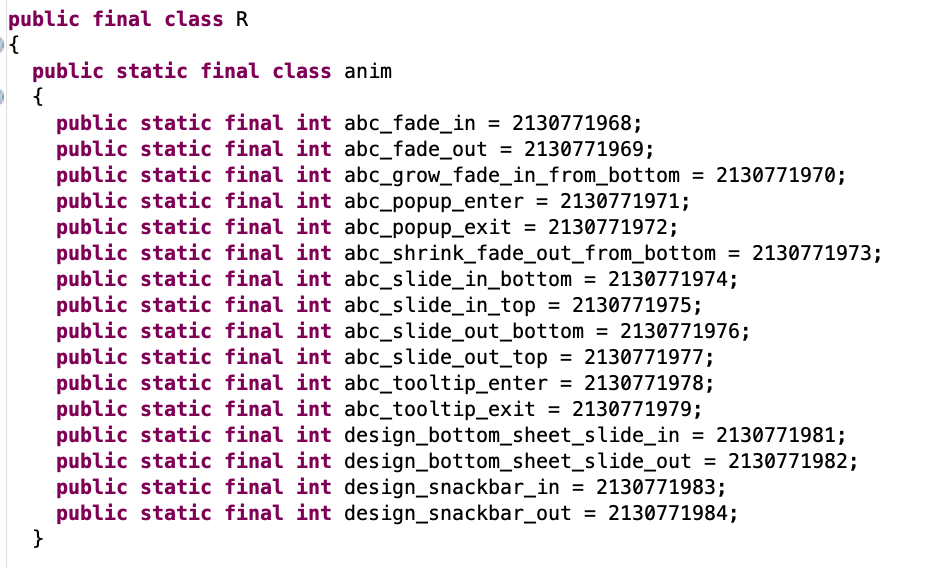
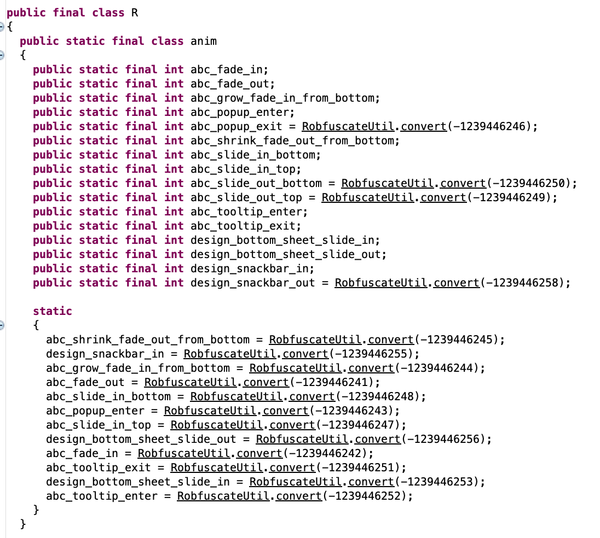

# Robfuscate


Obfuscate the int index of R.id/R.string/R.layout… in the classes.dex of Android project.

混淆 Android 项目中 R.id/R.string/R.layout… 等在代码中的 int 索引，可以略微提升破解难度。


#### Before



### After



### Limitation

It only works for R in the sub modules. For app level module, R.id will be replaced to static int value before Robfuscate so it will not work.


## Usage


1. Add the following into your project level `build.gradle`:

```groovy
  repositories {
        //...
        maven { url "https://jitpack.io" }
    }
    dependencies {
        //...
        classpath 'com.github.heruoxin:Robfuscate:master'
    }
```

2. Modify your app level `build.gradle`:

```groovy

apply plugin: 'com.android.application'
// NOTICE: Robfuscate must be added AFTER android plugin.
apply plugin: 'com.catchingnow.robfuscate'
```

Done.


## Acknowledgement


<https://github.com/brevent/genuine>

<https://github.com/MichaelRocks/paranoid>

